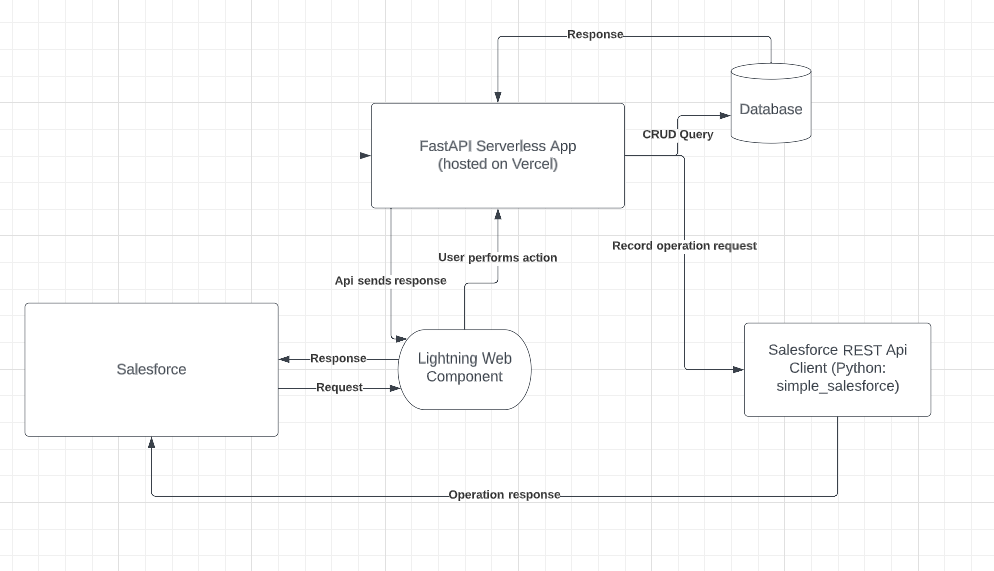

# Salesforce Integration

## Components 

### [Lighning Web Component](./LightningWebComponent/) - Salesforce app that posts data to and gets data from REST API

---

### [API Service](./API_Service/) - FastApi server (Serverless Vercel) to store and return data

---

## Design

